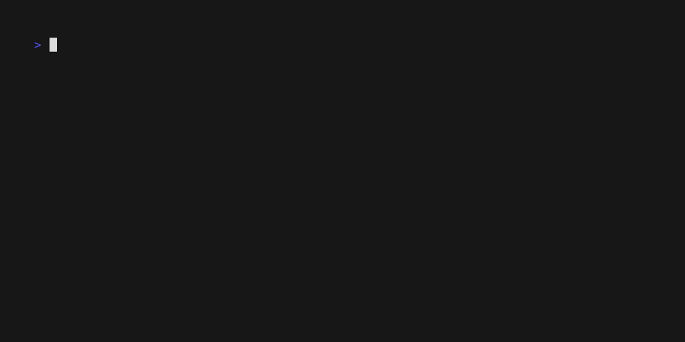

# project name

Lorem ipsum dolor sit amet, consectetur adipiscing elit. Vestibulum euismod tellus at blandit tempor.

# Table of contents

- [introduction](#introduction)
- [installation](#installation)
- [reference](#reference)

## introduction

TBD

## installation

TBD

## reference

TBD
